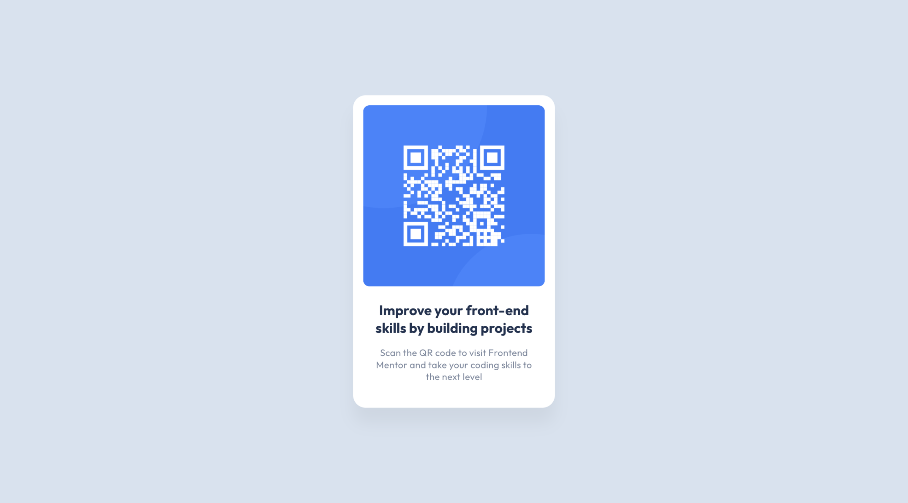

# Frontend Mentor - QR code component solution

This is a solution to the [QR code component challenge on Frontend Mentor](https://www.frontendmentor.io/challenges/qr-code-component-iux_sIO_H).

## Table of contents

- [Overview](#overview)
  - [Screenshot](#screenshot)
  - [Links](#links)
- [My process](#my-process)
  - [Built with](#built-with)
- [Author](#author)

## Overview

### Screenshot

| Desktop Preview                           |
| ----------------------------------------- |
|  |

| Mobile Preview                           |
| ---------------------------------------- |
|  |

### Links

- Solution URL: [Frontend Mentor Page](https://www.frontendmentor.io/solutions/qr-code-component-qcj23S8JC3)
- Live Site URL: [Deployed on Vercel](https://fm-2024-qr-code-component.vercel.app)

## My process

### Built with

- Semantic HTML5 markup
- CSS custom properties
- Flexbox
- Mobile-first workflow
- [React](https://reactjs.org/) - JS library
- [Next.js](https://nextjs.org/) - React framework
- [Tailwind CSS](https://tailwindcss.com/) - For styles

## Author

- Twitter - [@ardaekereu](https://www.twitter.com/ardaekereu)
- Frontend Mentor - [@ardaeker](https://www.frontendmentor.io/profile/ardaeker)
