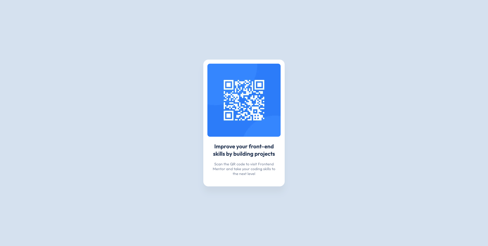

# Frontend Mentor - QR code component solution

This is a solution to the [QR code component challenge on Frontend Mentor](https://www.frontendmentor.io/challenges/qr-code-component-iux_sIO_H).

## Table of contents

- [Screenshot](#screenshot)
- [Links](#links)
- [Built with](#built-with)
- [Author](#author)

## Screenshot

|          Desktop           |
| :------------------------: |
|  |

|          Mobile           |
| :-----------------------: |
|  |

## Links

- Solution URL: [Solution](https://www.frontendmentor.io/solutions/qr-code-component-solution-mPZfZCTzfp)
- Live Site URL: [Live Site](https://qr-code-component-solution-ardaeker.vercel.app)

## Built with

- Semantic HTML5 markup
- Mobile-first workflow
- [Next.js](https://nextjs.org/) - React framework
- [Tailwind CSS](https://tailwindcss.com) - For styles

## Author

- Website - [www.ardaeker.com](https://ardaeker.com)
- Frontend Mentor - [@ardaeker](https://www.frontendmentor.io/profile/ardaeker)
